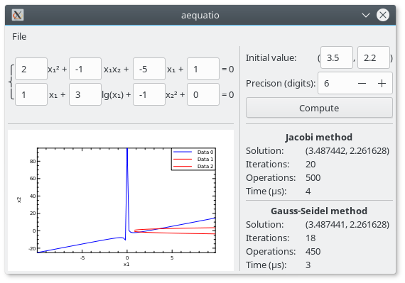

# Aequatio
**Aequatio** is a desktop application demonstrating equation system solving.

**Methods**:
* Jacobi (simple iterative) method;
* Gauss-Seidel method.

### Usage

User can set equation coefficients and computation accuracy.
Initial value can be approximated using interactive graph of equation.

### Third-part libraries
* [gtkmm](https://www.gtkmm.org/) for GUI
* [gtkmm-plplot](https://github.com/tschoonj/gtkmm-plplot) for graph
